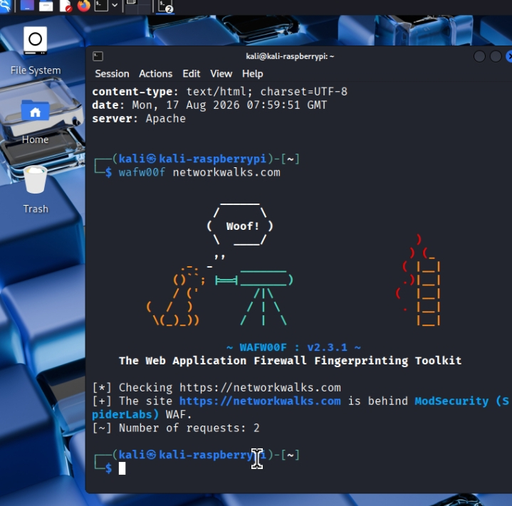

# Cybersecurity Assessment & Network Reconnaissance Report

**Program:** NetworkWalks Cybersecurity Internship — Batch B082  
**Project:** Week 2 — Penetration Testing / Network Reconnaissance  
**Lead Mentor:** Waqas Karim — Founder & Owner, NetworkWalks  
**Security Specialist:** Nura Muhammad Ibrahim  
**Date:** August 17, 2026  
**Status:** Completed

---

## 1. Executive Summary

This project represents my first structured cybersecurity assessment and security analysis conducted as part of the NetworkWalks Cybersecurity Internship.

The assessment focused on two primary areas:

1. Passive reconnaissance and information gathering.
2. Active network discovery and security analysis.

The objective was to understand how publicly available information and network-level discovery can reveal an organization's potential attack surface.

The assessment was performed within an authorized and controlled learning environment. No unauthorized systems were targeted.

The project also included analysis of identified risks and recommendations for improving the security posture of the assessed environment.

---

## 2. Assessment Objectives

The main objectives of this project were to:

- Identify publicly available information about the target.
- Enumerate DNS and domain infrastructure.
- Identify technologies used by the web application.
- Analyze HTTP response headers.
- Identify exposed application interfaces.
- Detect the presence of a Web Application Firewall (WAF).
- Discover active hosts within the authorized network.
- Analyze potential security risks.
- Document findings professionally.
- Provide practical security recommendations.

---

# 3. Methodology

The assessment followed a structured reconnaissance and discovery methodology.

### Phase 1 — Passive Reconnaissance

Passive reconnaissance was used to collect information without directly interacting with the target in an intrusive manner.

Tools used:

- WHOIS
- DNSRecon
- nslookup
- WhatWeb

### Phase 2 — Active Discovery

Active discovery was performed within the authorized lab environment to identify live hosts and understand the network structure.

Tools used:

- cURL
- wafw00f
- Zenmap / Nmap

---

# 4. Technical Analysis

## 4.1 WHOIS — Domain Information

WHOIS was used to obtain publicly available domain registration and infrastructure information.

### Information reviewed

- Domain registration information
- Registrar information
- Name servers
- Registration dates
- Public administrative information where available

### Security relevance

Domain information can help security professionals understand the external footprint of an organization.

It can also provide attackers with useful reconnaissance information if excessive information is publicly exposed.

---

## 4.2 DNSRecon — DNS Enumeration

DNSRecon was used to identify publicly available DNS records.

The assessment reviewed records such as:

- A
- AAAA
- MX
- TXT

SPF information was also reviewed to understand the organization's email-security configuration.

### Security relevance

DNS records can reveal:

- Public infrastructure
- Mail servers
- Hosting providers
- Subdomains
- Email-security configuration

Organizations should regularly review their DNS records and remove unnecessary or outdated entries.

---

## 4.3 nslookup — DNS Verification

The `nslookup` utility was used to verify DNS responses and resolve domain information.

### Objective

The purpose was to confirm:

- Domain-to-IP resolution
- Authoritative DNS responses
- Name-server information

This provided an additional verification step against the DNS reconnaissance results.

---

## 4.4 WhatWeb — Web Technology Fingerprinting

WhatWeb was used to identify technologies associated with the web application.

The assessment identified technologies including:

- WordPress
- WP Download Manager

### Security relevance

Technology fingerprinting can reveal software versions and components that may help an attacker identify potential vulnerabilities.

Security teams should keep CMS platforms, themes, plugins, and supporting software updated and remove unnecessary components.

---

## 4.5 cURL — HTTP Header and API Analysis

cURL was used to inspect HTTP responses from the web application.

The assessment identified the WordPress REST API path:

`/wp-json/`

### Security relevance

Publicly accessible API endpoints are not automatically vulnerabilities. However, exposed endpoints should be reviewed to ensure that they do not disclose unnecessary information or allow unauthorized actions.

API endpoints should be protected through appropriate authentication, authorization, rate limiting, and monitoring where required.

---

## 4.6 wafw00f — WAF Detection

wafw00f was used to determine whether a Web Application Firewall was present.

The assessment indicated the presence of ModSecurity-related WAF protection.

### Security relevance

A WAF provides an additional defensive layer between users and a web application.

However, a WAF should not be treated as a replacement for secure application development, patch management, authentication controls, and proper server configuration.

---

## 4.7 Zenmap / Nmap — Network Discovery

Zenmap was used to perform host discovery within the authorized lab network.

The scan identified **four live hosts** within the assessed network segment.

The results were also used to create a visual representation of the discovered network environment.

### Security relevance

Network discovery can identify:

- Active devices
- IP addresses
- MAC addresses
- Network vendors
- Potentially exposed systems

Organizations should maintain visibility over devices connected to internal networks and restrict unauthorized access.

---

# 5. Tools Used

| Tool | Purpose |
|---|---|
| WHOIS | Domain and registration information |
| DNSRecon | DNS enumeration |
| nslookup | DNS verification |
| WhatWeb | Web technology fingerprinting |
| cURL | HTTP header and API inspection |
| wafw00f | WAF detection |
| Zenmap / Nmap | Network host discovery |

---

# 6. Findings and Risk Analysis

| ID | Finding | Risk | Severity |
|---|---|---|---|
| SEC-01 | Web technology information was identifiable | Technology information may assist version-specific reconnaissance | Medium |
| SEC-02 | Public DNS and mail records were identifiable | DNS information can help attackers map external infrastructure | Low |
| SEC-03 | Multiple live hosts were discovered on the authorized network | Unnecessary network exposure can increase the internal attack surface | Medium |
| SEC-04 | WordPress REST API endpoint was publicly accessible | Public API exposure should be reviewed for unnecessary information disclosure and authorization weaknesses | Low |

### Severity Classification

**Low:** Limited security impact or primarily informational.

**Medium:** Could assist reconnaissance or contribute to a larger attack if combined with other weaknesses.

**High:** Could directly lead to significant unauthorized access, data exposure, or system compromise.

> Note: The severity ratings in this project are based on reconnaissance and observed exposure. They do not represent confirmed exploitation or a formal CVSS assessment.

---

# 7. Risk Analysis

The assessment demonstrates an important security principle:

> Information that appears harmless individually can become valuable when multiple pieces of information are combined.

For example, an attacker could potentially combine:

- DNS information
- Web technology information
- API information
- Network discovery results

to build a more complete picture of an organization's attack surface.

Therefore, organizations should minimize unnecessary information exposure and continuously monitor their infrastructure.

---

# 8. Recommendations

## 8.1 Reduce Information Disclosure

Review web-server and application configurations to minimize unnecessary technology and version information.

Where appropriate:

- Review HTTP response headers.
- Remove unnecessary banners.
- Keep CMS software updated.
- Remove unused plugins and components.

---

## 8.2 Secure REST API Endpoints

Review publicly accessible API endpoints and ensure that:

- Authentication is properly implemented where required.
- Authorization controls are enforced.
- Sensitive information is not unnecessarily exposed.
- Rate limiting is configured where appropriate.
- API activity is monitored.

---

## 8.3 Improve Internal Network Visibility

Organizations should maintain an updated inventory of devices connected to internal networks.

Recommended controls include:

- Network Access Control (NAC)
- VLAN segmentation
- Firewall rules
- Device monitoring
- Regular network discovery
- Removal of unauthorized devices

---

## 8.4 Maintain Strong Patch Management

Web applications, CMS platforms, plugins, operating systems, and network devices should be regularly updated.

Security teams should monitor vendor security advisories and prioritize patches for known vulnerabilities.

---

# 9. Evidence & Screenshots

The following evidence was collected during the assessment and is included in this repository.

### Evidence 01 — WHOIS

Domain registration and infrastructure information.

---

### Evidence 02 — DNSRecon

DNS records and mail-security information.

---

### Evidence 03 — nslookup

DNS resolution and name-server verification.

---

### Evidence 04 — WhatWeb

Web technology fingerprinting results.

---

### Evidence 05 — cURL

HTTP response and REST API inspection.

---

### Evidence 06 — wafw00f

Web Application Firewall detection.

---

### Evidence 07 — Zenmap Network Discovery

Live host discovery within the authorized lab network.

---

### Evidence 08 — Zenmap Network Topology

Visual representation of discovered network devices.

> **Evidence note:** All screenshots in this repository were collected during the authorized cybersecurity lab exercise and are provided for educational and portfolio documentation purposes.

---

# 10. Lessons Learned

This project provided practical experience in:

- Passive reconnaissance
- DNS enumeration
- Domain analysis
- Web technology fingerprinting
- HTTP analysis
- API exposure analysis
- WAF identification
- Network discovery
- Risk assessment
- Security documentation
- Security hardening recommendations

The most important lesson was understanding that reconnaissance is a critical stage of cybersecurity assessment because it helps identify the attack surface before deeper security testing begins.

---

# 11. Project Limitations

This was an introductory cybersecurity assessment and was not intended to represent a complete professional penetration test.

The assessment did not include:

- Exploitation of vulnerabilities
- Credential attacks
- Social engineering
- Denial-of-service testing
- Destructive testing
- Data exfiltration
- Persistence testing

The findings therefore represent observed exposure and potential risks rather than confirmed compromise.

---

# 12. Authorization and Ethics

All testing activities were performed within the authorized learning environment provided for the NetworkWalks cybersecurity training program.

The project followed responsible security-testing principles.

No unauthorized systems were intentionally targeted.

---

# 13. Conclusion

This project successfully demonstrated a structured approach to cybersecurity reconnaissance, network discovery, technical analysis, and risk assessment.

The assessment showed how security professionals can use common reconnaissance tools to understand an organization's attack surface and identify areas that require additional security controls.

Although this was my first project report, it provided practical experience that will serve as a foundation for more advanced penetration testing and security assessment activities.

---

# 14. Author & Mentorship

**Security Specialist:**  
Nura Muhammad Ibrahim

**Lead Mentor:**  
Waqas Karim  
Founder & Owner — NetworkWalks

**Program:**  
NetworkWalks Cybersecurity Internship — Batch B082

**Project:**  
Week 2 — Cybersecurity Assessment & Network Reconnaissance

---

## Disclaimer

This repository is intended for educational and cybersecurity portfolio purposes.

All security testing described in this report was performed against authorized systems and lab environments. Never perform security testing against systems you do not own or do not have explicit permission to assess.
