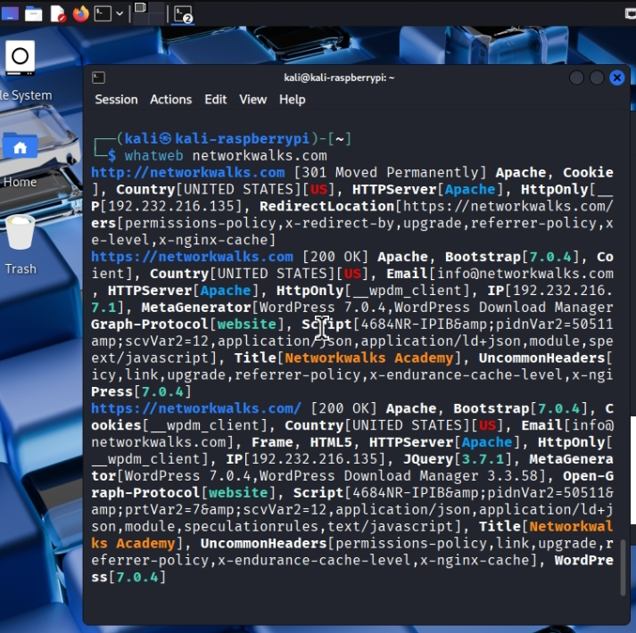

# Cybersecurity Assessment & Network Reconnaissance Report

**Program:** Networkwalks Cybersecurity Internship (Batch B082)[span_0](start_span)[span_0](end_span)[span_1](start_span)[span_1](end_span)  
**Lead Mentor:** Waqas Karim (Owner & Founder, Networkwalks)  
**Security Specialist:** Nura Muhammad Ibrahim  
**Date:** August 17, 2026  
**Status:** Completed & Validated  

---

## 1. Executive Summary

This project documents a structured Phase 1 (Passive Reconnaissance & Footprinting) and Phase 2 (Active Network Discovery) security assessment executed within a strictly controlled lab environment[span_2](start_span)[span_2](end_span)[span_3](start_span)[span_3](end_span). Under the direct mentorship of **Waqas Karim**, the engagement evaluated target attack surfaces, enumerated network endpoints, analyzed Web Application Firewall (WAF) rule coverage, and derived mitigation strategies to harden system defenses[span_4](start_span)[span_4](end_span)[span_5](start_span)[span_5](end_span)[span_6](start_span)[span_6](end_span).

All assessment activities strictly adhered to formal written authorization guidelines, ensuring full legal and operational compliance[span_7](start_span)[span_7](end_span)[span_8](start_span)[span_8](end_span).

---

## 2. In-Depth Project & Technical Analysis

### 2.1 Attack Surface Footprinting (Passive Phase)
During the passive reconnaissance phase, non-intrusive metadata gathering was conducted to map external infrastructure without triggering security alerts:
* **Domain & Registrar Profiling:** Executed `whois` queries to extract administrative domain metadata, registration timelines, and primary name server configurations[span_9](start_span)[span_9](end_span)[span_10](start_span)[span_10](end_span)[span_11](start_span)[span_11](end_span).
* **DNS Infrastructure Mapping:** Used `dnsrecon` and `nslookup` to enumerate DNS records ($A$, $AAAA$, $MX$)[span_12](start_span)[span_12](end_span)[span_13](start_span)[span_13](end_span)[span_14](start_span)[span_14](end_span). Analysis revealed active SPF ($TXT$) records, providing visibility into the organization's mail handling architecture[span_15](start_span)[span_15](end_span)[span_16](start_span)[span_16](end_span)[span_17](start_span)[span_17](end_span).

### 2.2 Application Stack & Header Fingerprinting
* **Web Technology Identification:** Utilizing `whatWeb`, the target application was fingerprinted, identifying core frameworks including WordPress `7.0.4` and WP Download Manager `3.3.58`[span_18](start_span)[span_18](end_span)[span_19](start_span)[span_19](end_span)[span_20](start_span)[span_20](end_span).
* **HTTP Response Header Analysis:** Performed banner grabbing via `curl`, revealing active REST API routes (`/wp-json/`)[span_21](start_span)[span_21](end_span)[span_22](start_span)[span_22](end_span)[span_23](start_span)[span_23](end_span). Unauthenticated REST endpoints allow adversaries to map published routes and harvest user accounts without authorization[span_24](start_span)[span_24](end_span)[span_25](start_span)[span_25](end_span)[span_26](start_span)[span_26](end_span).

### 2.3 WAF Profiling & Network Topology Discovery (Active Phase)
* **Firewall Rule Detection:** Deployed `wafw00f` against HTTP/HTTPS endpoints, confirming active ModSecurity Web Application Firewall signatures designed to inspect incoming HTTP payloads[span_27](start_span)[span_27](end_span)[span_28](start_span)[span_28](end_span)[span_29](start_span)[span_29](end_span).
* **Subnet Scanning & Visual Mapping:** Executed ICMP host discovery sweeps via `Zenmap` across the local subnet segment, mapping 4 live internal host endpoints, identifying associated MAC address vendor profiles, and building a visual network topology tree[span_30](start_span)[span_30](end_span)[span_31](start_span)[span_31](end_span)[span_32](start_span)[span_32](end_span).

---

## 3. Toolkit Visual Gallery & Evidence Log

| Tool & Technique | Evidence Image | Technical Output |
| :--- | :---: | :--- |
| **WHOIS**   *(Domain Metadata)* |  | Registrar info, administrative contacts, primary NS[span_33](start_span)[span_33](end_span)[span_34](start_span)[span_34](end_span)[span_35](start_span)[span_35](end_span). |
| **DNSRecon**   *(DNS Enumeration)* |  | A, AAAA, MX records, and SPF security policies[span_36](start_span)[span_36](end_span)[span_37](start_span)[span_37](end_span)[span_38](start_span)[span_38](end_span). |
| **nslookup**   *(Name Server Lookup)* |  | Direct host-to-IP mappings and authoritative responses[span_39](start_span)[span_39](end_span)[span_40](start_span)[span_40](end_span)[span_41](start_span)[span_41](end_span). |
| **WhatWeb**   *(Stack Fingerprinting)* |  | WordPress build version and active application plugins[span_42](start_span)[span_42](end_span)[span_43](start_span)[span_43](end_span)[span_44](start_span)[span_44](end_span). |
| **cURL**   *(Header & API Inspection)* |  | Server response headers and unauthenticated `/wp-json/` route[span_45](start_span)[span_45](end_span)[span_46](start_span)[span_46](end_span)[span_47](start_span)[span_47](end_span). |
| **wafw00f**   *(WAF Fingerprinting)* |  | Active ModSecurity Web Application Firewall detection[span_48](start_span)[span_48](end_span)[span_49](start_span)[span_49](end_span)[span_50](start_span)[span_50](end_span). |
| **Zenmap**   *(Subnet Discovery)* |  | Live IP host sweeps and associated MAC vendor addresses[span_51](start_span)[span_51](end_span)[span_52](start_span)[span_52](end_span)[span_53](start_span)[span_53](end_span). |
| **Zenmap**   *(Network Topology)* |  | Visual topology map showing route paths and active endpoints[span_54](start_span)[span_54](end_span)[span_55](start_span)[span_55](end_span)[span_56](start_span)[span_56](end_span). |

---

## 4. Findings & Impact Matrix

| ID | Observation / Finding | Technical Context | Impact Analysis | Severity |
| :---: | :--- | :--- | :--- | :---: |
| **SEC-01** | **Verbose CMS Metadata** | WhatWeb disclosed WordPress 7.0.4 & WP Download Manager[span_57](start_span)[span_57](end_span)[span_58](start_span)[span_58](end_span)[span_59](start_span)[span_59](end_span). | Enables version-specific CVE targeting by threat actors[span_60](start_span)[span_60](end_span)[span_61](start_span)[span_61](end_span)[span_62](start_span)[span_62](end_span). | **Medium** |
| **SEC-02** | **DNS & Mail Route Exposure** | DNSRecon mapped public MX and SPF entries[span_63](start_span)[span_63](end_span)[span_64](start_span)[span_64](end_span)[span_65](start_span)[span_65](end_span). | Discloses internal mail flow, increasing phishing susceptibility[span_66](start_span)[span_66](end_span). | **Medium** |
| **SEC-03** | **Unrestricted Subnet Host Exposure** | Zenmap mapped 4 live internal IP & MAC addresses[span_67](start_span)[span_67](end_span)[span_68](start_span)[span_68](end_span)[span_69](start_span)[span_69](end_span). | Provides initial internal targets for lateral movement[span_70](start_span)[span_70](end_span)[span_71](start_span)[span_71](end_span)[span_72](start_span)[span_72](end_span). | **Medium** |
| **SEC-04** | **Unauthenticated API Route** | `curl` identified exposed `/wp-json/` path[span_73](start_span)[span_73](end_span)[span_74](start_span)[span_74](end_span)[span_75](start_span)[span_75](end_span). | Facilitates automated account enumeration[span_76](start_span)[span_76](end_span)[span_77](start_span)[span_77](end_span)[span_78](start_span)[span_78](end_span). | **Low** |

---

## 5. Strategic Recommendations & Hardening

1. **Server Header Suppression:** Configure Apache/Nginx web server directives to suppress `Server` and `X-Powered-By` banners and disable CMS version tags[span_79](start_span)[span_79](end_span)[span_80](start_span)[span_80](end_span).
2. **API Access Restriction:** Implement access control rules or rate-limiting on REST API endpoints (`/wp-json/wp/v2/users`) to prevent user enumeration[span_81](start_span)[span_81](end_span).
3. **Internal Subnet Monitoring:** Deploy continuous automated port scanning and network access control (NAC) policies to detect rogue devices on local network segments[span_82](start_span)[span_82](end_span)[span_83](start_span)[span_83](end_span).

---

## 6. Author & Mentorship Acknowledgments

* **Lead Mentor:** **Waqas Karim** (Founder & Owner of Networkwalks)[span_84](start_span)[span_84](end_span)[span_85](start_span)[span_85](end_span)
* **Security Specialist:** Nura Muhammad Ibrahim
* **Authorization Artifacts:** Letter of Authorization Ref: `NW-LOA-B082-017`[span_86](start_span)[span_86](end_span)[span_87](start_span)[span_87](end_span)
