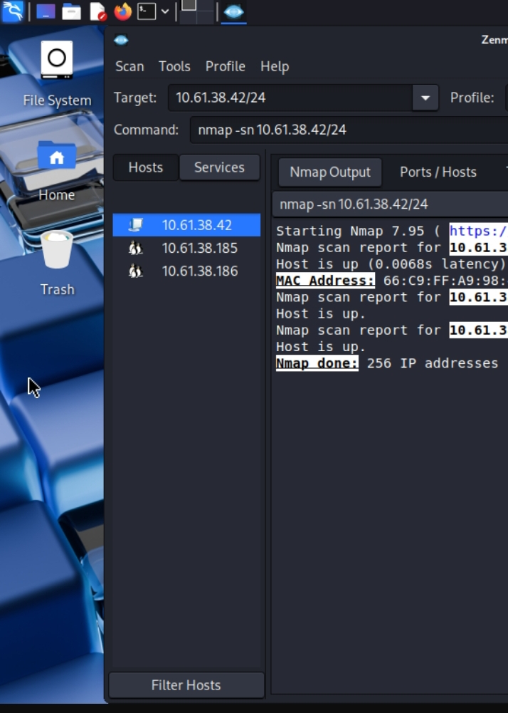
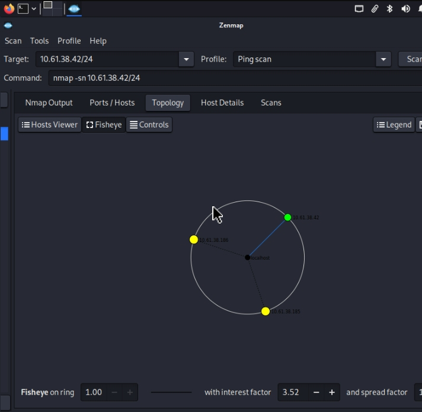

# Footprinting & Network Scanning Report (Week 2 Final)

**Author:** Emmanuel John (B082-Networkwalks)  
**Date:** 17 August 2026  
**Program:** Cybersecurity Internship at Networkwalks (Batch B082)  
**Modules:** W2-PM1 (Kali Reconnaissance Tools) & W2-PM5 (Zenmap Scanning)  
**Target Scope:** networkwalks.com (Authorized Footprinting) & Local LAN Subnet (Self-Owned Network)  

---

## ‹ Executive Overview

This repository details the Phase 1 (Reconnaissance & Footprinting) and Phase 2 (Scanning & Network Discovery) assessments completed during Week 2. The project demonstrates the methodology used to move from passive public domain enumeration to active local host discovery.

---

## › ️ Tools & Scope Matrix

* **WHOIS** (Kali Linux): Domain registration metadata and name server identification
* **WhatWeb** (Kali Linux): Web technology, CMS, and plugin fingerprinting
* **Nslookup** (Kali Linux): A, AAAA, and MX record resolution
* **cURL (`curl -I`)** (Kali Linux): HTTP header analysis and banner grabbing
* **Wafw00f** (Kali Linux): Web Application Firewall (WAF) detection
* **DNSRecon** (Kali Linux): Comprehensive DNS enumeration (MX, SPF, TXT, SRV)
* **Zenmap** (Windows / Kali): Ping scan host discovery, IP/MAC extraction, and topology mapping
* **ipconfig** (Windows CMD): Local interface network verification

---

## Findings & Risk Matrix

* **Web Technology Exposure:** WhatWeb identified WordPress 7.0.4 and WP Download Manager 3.3.58 (Medium Risk).
* **DNS & Infrastructure Profile:** DNSRecon and WHOIS mapped domain registrars, mail exchange servers, and name servers (Medium Risk).
* **Active Host Exposure:** Zenmap identified active local IP/MAC pairs (10.0.0.1, 10.0.0.4, 10.0.0.19, 10.0.0.5) (Medium Risk).
* **API & Header Footprint:** cURL exposed the WordPress REST API endpoint (/wp-json/) (Low Risk).
* **WAF Protection Detected:** Wafw00f identified active protection via ModSecurity (SpiderLabs) (Low Risk).

---

## “¸ Assessment Evidence & Tool Screenshots

Below is the structured proof archive displaying the execution outputs for each module.

### 1. Local Interface Identification (ipconfig)
Captures source network interface settings and default gateway parameters.  

---

### 2. Domain Registration Metadata (whois)
Extracts registrar information and authoritative name servers for networkwalks.com.  

---

### 3. Domain Resolution (nslookup)
Resolves domain endpoints to target IP address 192.232.216.135.  

---

### 4. Advanced DNS Record Enumeration (dnsrecon)
Maps SPF records, mail exchangers, service records, and zone configurations.  

---

### 5. Web Application Firewall Detection (wafw00f)
Verifies active WAF defenses and identifies ModSecurity signature rulesets.  

---

### 6. Web Technology Stack Fingerprinting (whatweb)
Fingerprints web server headers, CMS versions, and active site plugins.  

---

### 7. HTTP Header Response Inspection (curl)
Extracts HTTP response headers and locates the public REST API endpoint.  

---

### 8. Subnet Host Discovery (zenmap1.png)
Performs local ping scans to enumerate active IP addresses and MAC configurations.  

---

### 9. Network Topology & Service Details (zenmap2.png)
Generates structural network topology visual layouts and service details.  

---

## 🔒 Primary Remediation Recommendations

1. **Information Disclosure Control:** Suppress verbose HTTP server banners and hide CMS version numbers.
2. **DNS Hardening:** Audit public DNS records to ensure unnecessary service entries are masked.
3. **Internal Monitoring:** Periodically run internal discovery scans to track unauthorized devices on local subnets.
